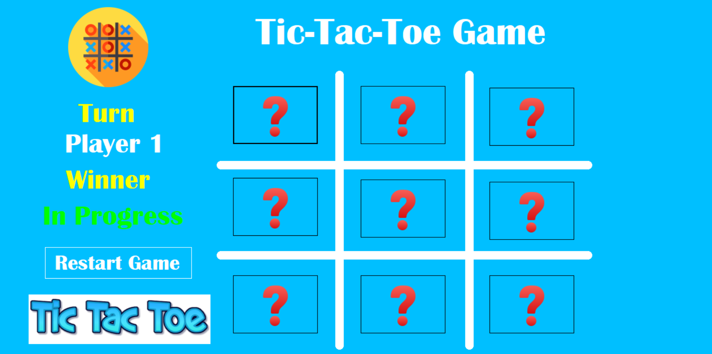

# Tic-Tac-Toe Game

A simple Tic-Tac-Toe game built with C# and Windows Forms.

## Features
- Two-player mode
- Simple and intuitive interface
- Game reset button

## How to Run
1. Open the solution in Visual Studio.
2. Build the project.
3. Run the application.

4. 

## License
This project is licensed under the MIT License.
